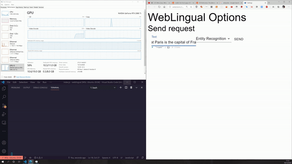

# Weblingual
A general framework for natural language tasks for day-to-day usages using recent developments of ML and NLP. Specifically, transformers are crucially used here so the performance is quite good.

# Tasks
- Named Entity Recognition
    - Identify named entities on webpages and replace them with links

# Demo
